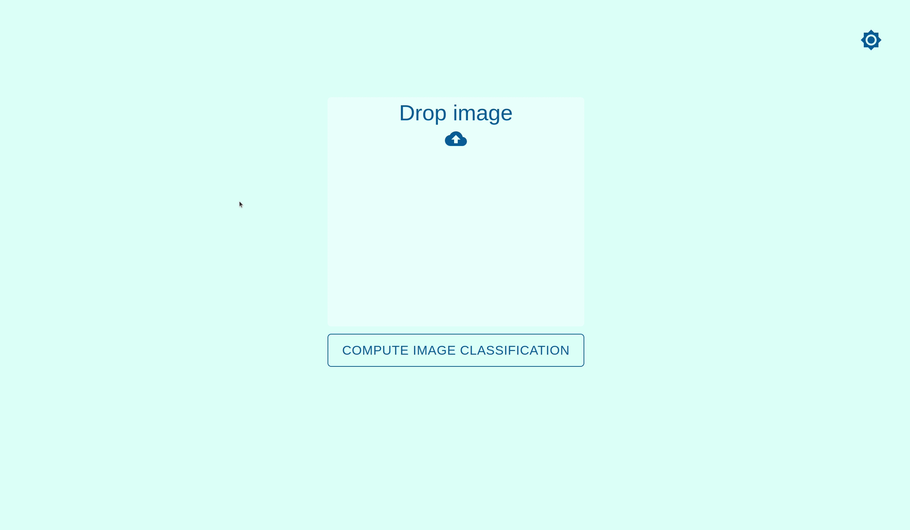
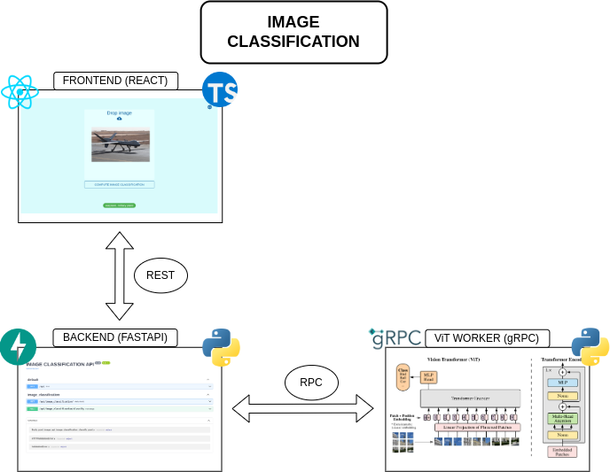

# Image classification

A web app for image classification.
Built with **docker, docker-compose, fastapi, gRPC, react-typescript and nginx**.



## Run the project

```bash
git clone git@github.com:rm-rfred/image_classification.git

cd image_classification

docker-compose build
docker-compose up -d
```

The app is available on your [browser](http://172.17.0.1:10133)

## Architecture



## Model: Vision Transformer (ViT)

The Vision Transformer (ViT) model was proposed in An Image is Worth 16x16 Words: Transformers for Image Recognition at Scale by Alexey Dosovitskiy, Lucas Beyer, Alexander Kolesnikov, Dirk Weissenborn, Xiaohua Zhai, Thomas Unterthiner, Mostafa Dehghani, Matthias Minderer, Georg Heigold, Sylvain Gelly, Jakob Uszkoreit, Neil Houlsby. It’s the first paper that successfully trains a Transformer encoder on ImageNet, attaining very good results compared to familiar convolutional architectures.


For additional ressources on Vision Transformers, please refer to [paperswithcode](https://paperswithcode.com/method/vision-transformer)
Learn more about Hugging Face's implementation on the [official website](https://huggingface.co/docs/transformers/model_doc/vit) :hugs:

## gRPC image classification worker

Check out the image classification gRPC worker serving vit-base-patch16-224 model [here](https://github.com/rm-rfred/vit-worker)

## Dependencies

Docker version **24.0.6**, build ed223bc
Docker Compose version **v2.23.0**

### Shutdown the app

```bash
docker-compose down
```
